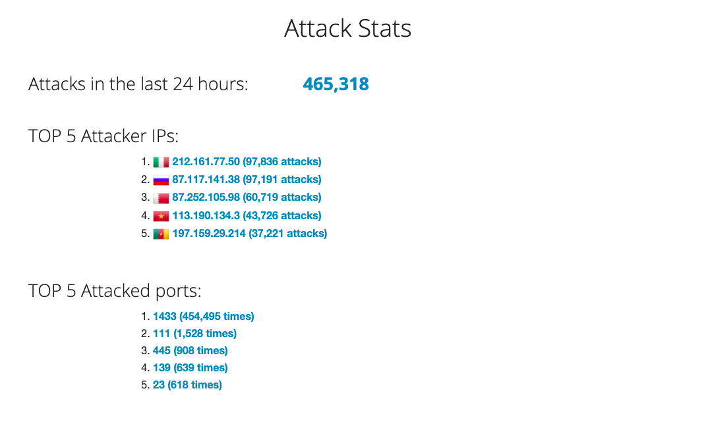
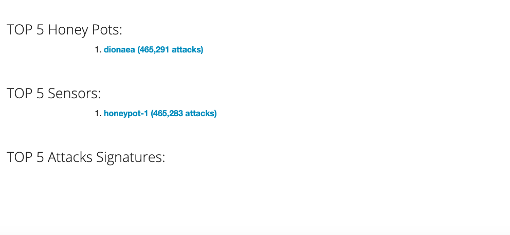
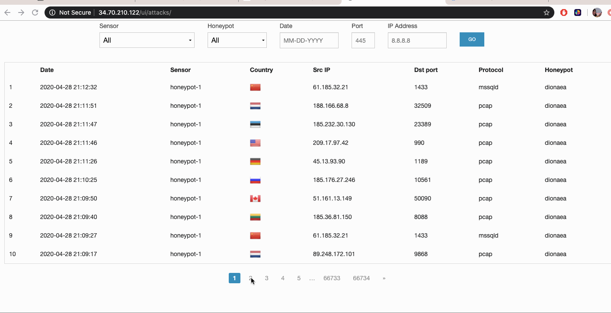

# Project 9 - HoneyPot

## HoneyPot Deployed: 
Dionaea (1x)

##Issues: 
   - Working with Google Cloud Platform for the first time was difficult due to the the sheer complexity of the platform. 
   - Issues with attacking the honeypot through Kali linux - had to restart the kali VM multiple times. 
	

## Summary of Data Collected: 

Total Number of Attacks: 667,786

## Unresolved Questions: 

How am I supposed to be able to find any indication of malware attacks to the honeypot?

