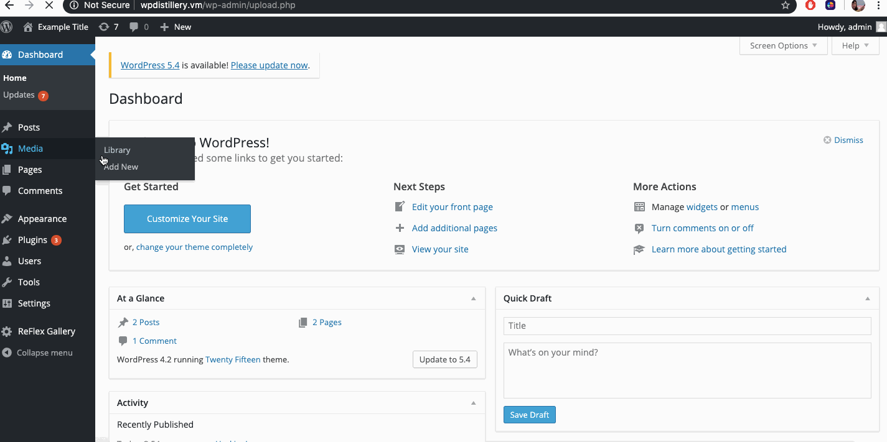
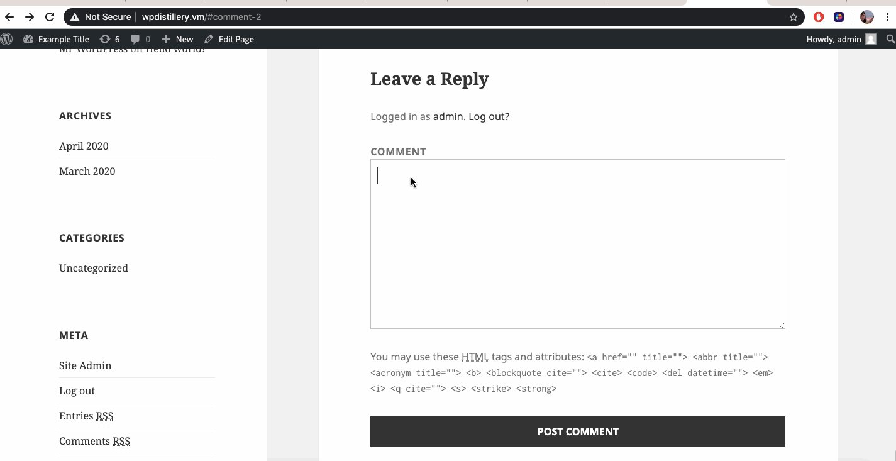
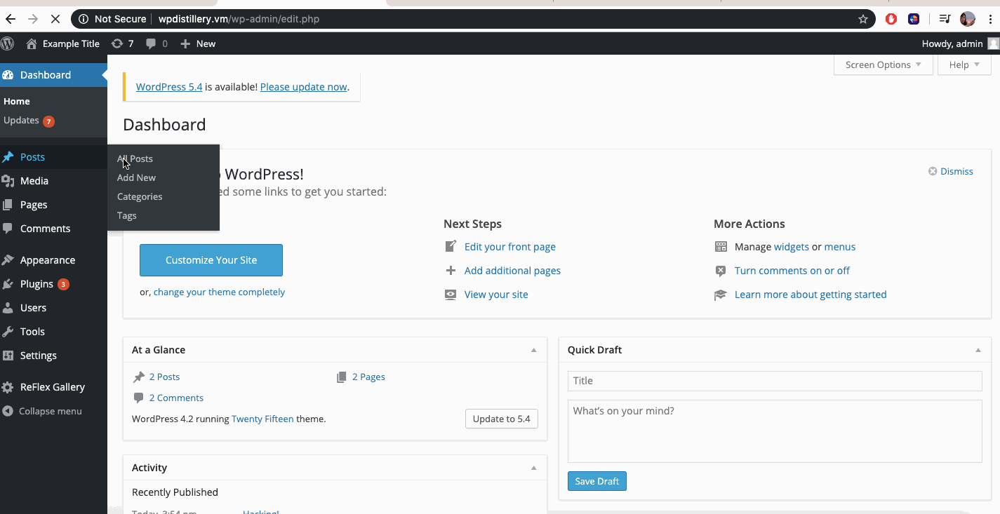

# Web-Security - CSC 59938 :: Project 7 - WordPress Pentesting

Time spent: 5 hours spent in total

> Objective: Find, analyze, recreate, and document **five vulnerabilities** affecting an old version of WordPress

## Pentesting Report

1. (Required) Authenticated Cross-Site Scripting through Media File Data

  - [ ] Summary: 
    - Vulnerability types: Cross-Site Scripting 
    - Tested in version: 4.2
    - Fixed in version: 4.7.3

  - [ ] GIF Walkthrough: 
        

  - [ ] Steps to recreate: 																									
  		- Upload any media file that has the capacity to hold metadata through the admin portal.\
  		- After uploading, edit the descrption panel to hold "filename ".nsbp&
  		- Save and view the attachment in the blog where an XSS generated alert will appear.

  - [ ] Affected source code:
    - [WP_MEDIA_UPLOAD_PHP](https://core.trac.wordpress.org/browser/branches/4.2/src/wp-admin/media-upload.php)									

2. (Required) Unauthenticated XSS in Posted Comment

  - [ ] Summary: 
    - Vulnerability types: XSS / Buffer Overflow.
    - Tested in version: 4.2
    - Fixed in version: 4.2.1

  - [ ] GIF Walkthrough: 
  		

  - [ ] Steps to recreate: 																									
        - Through the user facing blog move to create and post a comment.\  
        - Use the template <a title='x onmouseover=alert(unescape(/hello%20world/.source)) style=position:absolute;left:0;top:0;width:5000px;height:5000px <REST OF COMMENT>'></a>nsbp&
        - Fill in <REST OF COMMENT> with an extremely large amount of data.\
        - Post the comment and scroll up to view the XSS alert.\

  - [ ] Affected source code:
    - [WP_COMMENTS_POST_PHP](https://core.trac.wordpress.org/browser/branches/4.2/src/wp-comments-post.php)

3. (Required) Authenticated Stored Cross-Site Scripting (XSS)

  - [ ] Summary: 
    - Vulnerability types: Cross-Site Scripting
    - Tested in version: 4.2
    - Fixed in version: 4.2.3

  - [ ] GIF Walkthrough:
  		 

  - [ ] Steps to recreate: 																								     	
  		- Through the admin portal create a new post.\ 
  		- In the post place a malicous link refrence that containes script in it such as: <a href="[caption code=">]</a><a title=" onmouseover=alert('HACKED!') "> link</a>nbsp&
  		- Create the post and view it from the front end.\ 
  		- Click on the link and an alert will appear.\ 
  
  - [ ] Affected source code:
    - [WP_ADMIN_POST_PHP](https://core.trac.wordpress.org/browser/branches/4.2/src/wp-admin/admin-post.php) 										

## Assets

	OWASP XSS CHEAT SHEET: https://owasp.org/www-community/xss-filter-evasion-cheatsheet

## Resources

- [WordPress Source Browser](https://core.trac.wordpress.org/browser/)
- [WordPress Developer Reference](https://developer.wordpress.org/reference/)

GIFs created with [LiceCap](http://www.cockos.com/licecap/).

## Notes

  --Finding and writing scripts the be automatically performed.  

## License

    Copyright [2020] [name of Copyright Owner]

    Licensed under the Apache License, Version 2.0 (the "License");
    you may not use this file except in compliance with the License.
    You may obtain a copy of the License at

        http://www.apache.org/licenses/LICENSE-2.0

    Unless required by applicable law or agreed to in writing, software
    distributed under the License is distributed on an "AS IS" BASIS,
    WITHOUT WARRANTIES OR CONDITIONS OF ANY KIND, either express or implied.
    See the License for the specific language governing permissions and
    limitations under the License.
